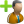

# Design guidelines for Reimplementation of Expertiza

## Overview  
This document serves as a comprehensive guide for the reimplementation of views in the Expertiza platform. The purpose of these guidelines is to ensure consistency, maintainability, and adherence to predefined UI/UX standards across all pages.  

Web applications consist of various interface elements that must follow a structured design approach. These elements include:  

- **Typography & Text Formatting** – Defines font styles, sizes, and capitalization rules for headings, subheadings, and body text to maintain a uniform visual hierarchy.  
- **Tables** – Standardizes the use of a prebuilt Table component to enforce a unified structure, styling, and data representation.  
- **Icons** – Specifies the approved icon library, icon sizes, and their usage in different UI components.  
- **Buttons** – Ensures consistent button styles, colors, and behavior across the platform using predefined Bootstrap-based components.  
- **Notifications** – Establishes a standardized approach for alert messages (success, error, info, warnings) to enhance user feedback and clarity.  
- **Forms** – Enforces the use of prebuilt form components, including input fields, dropdowns, validation messages, and tooltips for improved accessibility and usability.  
- **Dropdowns & Toggles** – Outlines best practices for dropdown menus and interactive UI elements using Bootstrap’s dropdown system.  
- **Pagination** – Defines when and how to enable pagination to optimize performance and usability for data-heavy pages.  
- **Date Formatting** – Ensures all dates and timestamps are displayed and stored in a consistent format across tables and forms.

By following these design guidelines, developers can ensure that all UI components remain visually cohesive, functionally robust, and user-friendly. These standards not only streamline development but also enhance the overall user experience by maintaining consistency across the platform. 

## Index  
1. [Text](#text)  
2. [Tables](#tables)  
3. [Icon Library](#icon-library)  
4. [Buttons](#buttons)  
5. [Notifications](#notifications)  
6. [Forms](#forms)  
7. [Dropdowns and Toggling Dropdowns](#dropdowns-and-toggling-dropdowns)  
8. [Pagination](#pagination)
9. [Date formatting](#date-formatting)  

## Text

* General font name: ```verdana,arial,helvetica,sans-serif```

* Headings/ Main title of page should be given in ```<h2>Title</h2>``` tag

* Capitalization:
    - Use camel case for headings.
    - Other text should have only the first letter of the first word capitalized, with all subsequent words in lowercase.

* Font sizes & line heights:
   - Standard text:
        - Font size: 13px
        - Line height: 30px
   - Subheadings:
        - Font size: 1.2em
        - Line height: 18px 
   - Table data:
        - Font size: 15px
        - Line height: 1.428em 

* Color
	- Menu bar - #FFFFFF; //for menubar with red background
	- Other titles/ text - #333; 
	- Text on red buttons - #fff;


## Tables

The **Table component** is prebuilt and must be used for all table-related functionalities. The component is located in:  
**`src/components/Table/Table.tsx`**

### Table usage
| **Requirement**        | **Implementation** |
|----------------------|------------------|
| **Component**       | Use **`Table.tsx`** (Do not create new table components) |
| **Styling**         | Bootstrap: `table table-striped` |
| **Global filter**   | **Disabled** |
| **Column filter**   | **Disabled** |
| **Pagination**      | Enabled only if **page is full** |
| **Sorting**        | Built-in with sorting indicators (`🔼` / `🔽`) |
| **Row selection**   | Available if `onSelectionChange` is provided |
| **Column visibility** | Configurable via `columnVisibility` prop |

### Example usage

```tsx
import Table from "src/components/Table/Table";

const columns = [
  { accessorKey: "name", header: "Student Name" },
  { accessorKey: "email", header: "Email Address" },
];

const data = [
  { name: "John Doe", email: "john@example.com" },
  { name: "Jane Smith", email: "jane@example.com" },
];

export default function ExampleTable() {
  return (
    <Table
      data={data}
      columns={columns}
      showGlobalFilter={false}
      showColumnFilter={false}
      showPagination={data.length >= 10}
    />
  );
}
```


---


## Icon library

Icons are available in four sizes: 16, 24, 32, and 48. However, it is possible that not all icons are available in every size. Edit the size number as needed; everything else will remain the same.
**Sr. No.** | **Element name** | **Image** | **Guide**	
|---|---|---|---|
|  1 |  Add assignment |   | To add 'add assignment' icon, use path **```/public/assets/icons/add-assignment-24.png```** |
|  2 |  Add teaching assistant |   | To add 'add TA' icon, use path **```public/assets/icons/add-ta-24.png```** |
|  3 |  Add private |   | To add 'add private' icon, use path **```public/assets/icons/add-private-24.png```** |
|  4 |  Add public |   | To add 'add public' icon, use path **```public/assets/icons/add-public-24.png```** |
|  5 |  Add signup sheet |   | To add 'add signup sheet' icon, use path **```public/assets/icons/add-signup-sheet-24.png```** |
|  6 |  Assign course |   | To add 'Assign course' icon, use path **```public/assets/icons/assign-course-blue-24.png```** |
|  7 |  Assign survey |   | To add 'Assign survey' icon, use path **```public/assets/icons/assign-survey-24.png```** |
|  8 |  Check |  | To add 'Check' icon, use path **```public/assets/icons/Check-icon.png```** |
|  9 | Copy |   | To add 'Copy' icon, use path **```public/assets/icons/Copy-icon-24.png```** |
|  10 |  Create team |   | To add 'Create team' icon, use path **```public/assets/icons/create-teams-24.png```** |
|  11 |  Delete |   | To add 'Delete' icon, use path **```public/assets/icons/delete-icon-24.png```** |
|  12 |  (General) Edit |   | To add 'Edit' icon, use path **```public/assets/icons/edit-icon-24.png```** |
|  13 |  Edit signup sheet |   | To add 'Edit signup sheet' icon, use path **```public/assets/icons/edit-signup-sheet-24.png```** |
|  14 |  Info |  | To add 'Info' icon, use path **```public/assets/icons/info.png```** |
|  15 | List all |   | To add 'List all' icon, add class as "glyphicon glyphicon-list-alt" |
|  16 |  List submissions |   | To add 'List submissions' icon, use path **```public/assets/icons/List-submissions-24.png```** |
|  17 |  Make public from private |   | To add 'Make public from private' icon,  use path **```public/assets/icons/lock-off-disabled-icon-24.png```**   |
|  18 |  Private |   | To add 'Private' icon,  use path **```public/assets/icons/lock-disabled-icon-24.png```**   |
|  19 |  Remove from course |   | To add 'Remove from course' icon,  use path **```public/assets/icons/remove-from-course-24.png```**   |
|  20 |  Run bidding assignment |   | To add 'Run bidding assignment' icon,  use path **```public/assets/icons/run-lottery.png```**   |
|  21 | Signup |  | To add 'Signup' icon, use path **```public/assets/icons/signup.png```** |
|  22 |  Search |   | To add 'Search' icon,  use path **```public/assets/icons/view-publish-rights-24.png```**   |
|  23 | Uncheck |  | To add 'Uncheck' icon, use path **```public/assets/icons/Uncheck-icon.png```** |
|  24 | View delayed mailer |  | To add 'View delayed mailer' icon, use path **```public/assets/icons/view-delayed-mailer.png```** |
|  25 |  View report |   | To add 'View report' icon,  use path **```public/assets/icons/view-review-report-24.png```**   |
|  26 |  View scores |   | To add "View score" icon,  use path **```public/assets/icons/view-scores-24.png```**   |
|  27 |  View suggestions |   | To add "View suggestions" icon,  use path **```public/assets/icons/view-suggestion-24.png```**   |
|  28 |  View survey |   | To add "View survey" icon,  use path **```public/assets/icons/view-survey-24.png```**   |
---

### Example Usage

```tsx
<Button className="btn btn-md btn-primary">
   Add Assignment
</Button>
```
---
## Buttons 

The default color for buttons is red 

we recommend using the `Button` class from `react-bootstrap` to ensure a consistent and unified appearance.

**Sr. No.** | **Element name** | **Image** | **Guide** | **Class** | **Variant** |
|---|---|---|---|---|---|
|  1 |  Button - Default style | *to be added*  | Default button | `btn btn-md` | `outline-secondary` |
|  2 |  Button - Success style | *to be added*  | For accepting. | `btn btn-md` | `success` |
|  3 |  Button - Danger style | *to be added*  | For rejecting. | `btn btn-md` | `danger` |
|  4 |  Button - New style | *to be added*  | For create buttons alone. | `btn pull-right new-button btn-md` | `primary` |

### ✅ Example usage

#### **Default button**
```tsx
import { Button } from "react-bootstrap";

<Button className="btn btn-default btn-md">Click Me</Button>
```


---
## Notifications

All notifications must follow **Bootstrap’s alert styling** and use the **predefined classes** to ensure consistency across the UI.

### 📌 Notification styles
| **Sr. No.** | **Element name** | **Guide** | **Class** |
|---|---|---|---|
|  1 |  Success | Display success messages | ```flash_note alert alert-success``` |
|  2 |  Error | Display error messages | ```flash_note alert alert-danger``` |
|  3 |  Info | Display informational messages | ```flash_note alert alert-info``` |
|  4 |  Warn | Display warning messages | ```flash_note alert alert-warning``` |


### ✅ Example usage

#### **Success notification**
```tsx
import { Alert } from "react-bootstrap";

<Alert className="flash_note alert alert-success">
  Operation completed successfully!
</Alert>
```


---

## Forms

The **Form component** is prebuilt and must be used for all Form-related functionalities. The component is located in:  
**`src/components/Form`**

| **Requirement**          | **Implementation**                                             |
|--------------------------|----------------------------------------------------------------|
| **Component**            | Use **prebuilt form components** (Do not create new form elements) |
| **Styling**              | Bootstrap: `form-control`                                      |
| **Validation**           | Built-in via **Formik**                                        |
| **Tooltips**             | Use `ToolTip` from `src/components/ToolTip.tsx`                |
| **Date picker**          | Uses `react-datepicker`, preconfigured                         |
| **Date format**          | Use `YYYY-MM-DD` (ISO 8601) format for consistency.       |
| **Checkbox & radio groups** | Prebuilt in `FormCheckboxGroup.tsx` and `FormRadioGroup.tsx`    |
| **Dropdowns**            | Use `FormSelect.tsx` (prebuilt)                                |
| **Range sliders**        | Use `FormRange.tsx`                                            |

### Example usage

The example below demonstrates how to use the FormCheckBox component. There are additional form components, such as FormInput, FormSelect, and FormRadioGroup. Import them and modify their props according to your requirements.

```tsx
import FormCheckBox from '../Form/FormCheckBox';

const formProps = {
  controlId: 'exampleCheckBox',
  label: 'Example Checkbox',
  name: 'exampleCheckBox',
  tooltip: 'Tooltip text',
  tooltipPlacement: 'right',
};

const MyPage: React.FC = () => (
  <div>
    <h1>My Page</h1>
    <FormCheckBox {...formProps} />
  </div>
);

export default MyPage;
```
---


## Dropdowns and toggling dropdowns

For dropdowns and toggling functionality, we recommend using the `Dropdown` class from `react-bootstrap` to ensure a consistent and unified appearance. 

The `react-bootstrap` library is already included in the `package.json` file, so you can directly utilize the provided dropdown styles.

### Example usage

```tsx
import { Dropdown } from "react-bootstrap";

export default function ExampleDropdown() {
  return (
    <Dropdown>
      <Dropdown.Toggle variant="primary" id="dropdown-basic">
        Select an Option
      </Dropdown.Toggle>

      <Dropdown.Menu>
        <Dropdown.Item href="#/action-1">Action 1</Dropdown.Item>
        <Dropdown.Item href="#/action-2">Action 2</Dropdown.Item>
        <Dropdown.Item href="#/action-3">Action 3</Dropdown.Item>
      </Dropdown.Menu>
    </Dropdown>
  );
}
```
---

## Pagination 

Enable pagination component when page is full. The user should be able to disable the pagination component if they want to search through the information.

Pagination Component is already included in the Repository under **```src\components\Table\Pagination.tsx```**. We recommend using this component to maintain consistency.

### Example usage

```tsx
import React from "react";
import { useTable, usePagination, TableState } from "@tanstack/react-table";
import Pagination from "../Pagination";

const MyTableComponent: React.FC = () => {
  const {
    getState,
    nextPage,
    previousPage,
    canNextPage,
    canPreviousPage,
    setPageIndex,
    setPageSize,
    getPageCount,
  } = usePagination();

  return (
    <div>
      <table>
        {/* Your table structure goes here */}
      </table>
      
      {/* Pagination Component */}
      <Pagination
        nextPage={nextPage}
        previousPage={previousPage}
        canNextPage={canNextPage}
        canPreviousPage={canPreviousPage}
        setPageIndex={setPageIndex}
        setPageSize={setPageSize}
        getPageCount={getPageCount}
        getState={getState as () => TableState} 
      />
    </div>
  );
};

export default MyTableComponent;
```
---

## Date formatting

To ensure consistency across the platform, all date values used in Tables and Forms should follow the **ISO 8601 format (`YYYY-MM-DD HH:MM:SS`)**.
